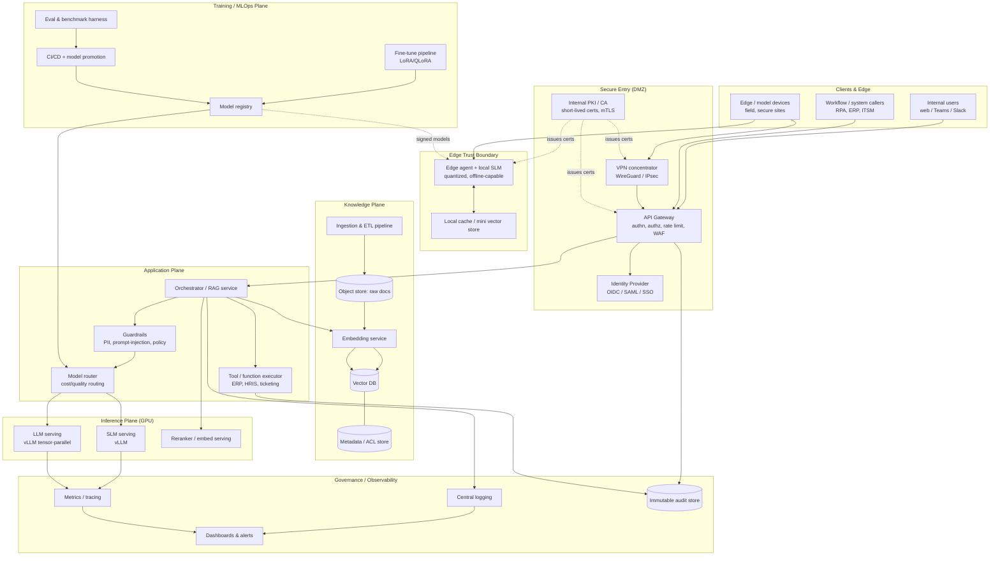
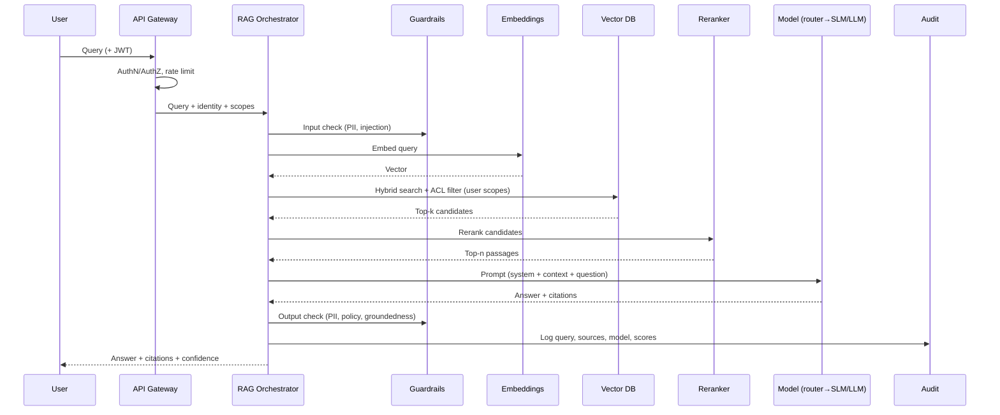
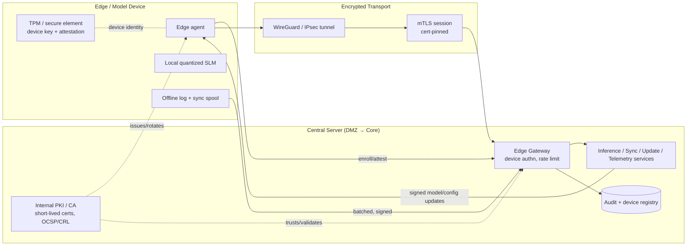

# 03 — Architecture Design

This document specifies the end‑to‑end architecture: data ingestion, vector database, embeddings, RAG, fine‑tuning pipeline, inference, API, authn/authz, monitoring/logging, and **secure connectivity between edge/model devices and the central server**.

Diagram sources are also in [`./diagrams/`](./diagrams/).

## 3.1 Logical architecture (layered view)

## 3.2 Component specifications

### Data ingestion layer
- **Connectors:** SharePoint/Confluence, file shares, ERP/HRIS/ITSM exports, databases, email, ticket systems, object storage.
- **Pipeline:** orchestrated by **Airflow / Dagster / Prefect**. Steps: fetch → parse (Unstructured / Apache Tika / PyMuPDF) → clean → **PII detection & masking** → chunk → embed → upsert to vector DB → record lineage/ACLs in metadata store.
- **Modes:** batch (nightly full/delta) + event‑driven (webhook/CDC) for fresh content.
- **Idempotency:** content‑hash + document version so re‑ingestion replaces, not duplicates.

### Embedding model
- **Default:** `bge‑large` / `bge‑m3` (multilingual) or `Qwen3‑Embedding`; served via **HF Text‑Embeddings‑Inference (TEI)** on GPU.
- **Chunking:** structure‑aware (headings, tables) 256–512 tokens with 10–20% overlap; store parent‑doc reference for "small‑to‑big" retrieval.
- **Versioning:** embedding model version stored per vector; re‑embed on model change (blue/green index).

### Vector database
- **Recommendation:** **Qdrant** (great filtering, RBAC, hybrid, easy self‑host) or **Milvus** (scale) ; **pgvector** acceptable for small/PoC.
- **Must support:** metadata filtering (for **row‑level ACL enforcement at retrieval time**), hybrid (dense + sparse/BM25) search, payload indexing, snapshots/backup, HA.
- **Index:** HNSW with tuned `M`/`ef`; collections segmented per security domain where needed.

### RAG service (the heart of accuracy)

- **Techniques:** hybrid retrieval, reranking, query rewriting/HyDE for recall, **citation enforcement** (answer must cite retrieved sources), **groundedness check** (self‑check or NLI), parent‑document retrieval, optional **agentic / multi‑hop** retrieval for complex questions.
- **ACL‑aware retrieval:** every chunk carries an ACL tag; the retriever filters to the **caller's entitlements** so users can never retrieve documents they can't access.

### Model router
- Routes each request to the **cheapest model meeting the quality bar**: rules + lightweight classifier on (use case, complexity, risk, context length, user tier).
- Escalation: SLM → mid‑tier → central LLM on low confidence/groundedness. Caches frequent answers (semantic cache) to cut cost.

### Inference layer
- **Engine:** **vLLM** (paged attention, continuous batching) primary; **TGI** or **TensorRT‑LLM** as alternatives; **llama.cpp/Ollama** at the edge.
- **Serving patterns:** dedicated pods per model; tensor parallel for 70B; autoscaling on queue depth/GPU util; warm pools to avoid cold starts.
- **Optimizations:** quantization (AWQ/GPTQ), KV‑cache reuse, prefix caching, speculative decoding where supported, request batching.

### API layer
- **Protocol:** REST + streaming (SSE) ; **OpenAI‑compatible** endpoint so internal apps integrate easily; gRPC for service‑to‑service.
- **Contracts:** versioned OpenAPI spec; idempotency keys; structured outputs (JSON schema / function calling).
- **Tenancy:** per‑app API keys + per‑user JWT; quotas and rate limits per identity.

### Authentication & authorization
- **AuthN:** corporate **SSO via OIDC/SAML** (Entra ID / Okta / Keycloak); service identities via mTLS client certs.
- **AuthZ:** **RBAC + ABAC** — roles (employee, manager, finance, HR, admin) + attributes (department, clearance, data domain). Enforced at gateway **and** at retrieval (ACL filter) — defense in depth.
- **Secrets:** **HashiCorp Vault** (or cloud KMS) for keys, DB creds, model registry tokens.

### Monitoring & logging
- **Metrics:** Prometheus + Grafana — GPU util/mem, tokens/s, TTFT, queue depth, error rates, cost/req.
- **Tracing:** OpenTelemetry across gateway→orchestrator→retrieval→model.
- **LLM observability:** Langfuse / Phoenix / OpenLLMetry — prompts, retrieved context, latencies, eval scores, drift.
- **Logging:** structured JSON to Loki/ELK; **immutable audit store** (WORM/append‑only) for security & compliance events.
- **Alerting:** SLO burn‑rate alerts, GPU saturation, quality regression, anomalous access.

### Training / MLOps plane
See [Doc 06](./06-training-and-finetuning.md). Model **registry** (MLflow) holds versioned, **signed** model artifacts; **CI/CD** promotes only models that pass eval gates; promoted models become available to the router and are **pushed (signed) to edge devices**.

## 3.3 Secure connectivity: edge / model devices ↔ central server

This is a first‑class requirement. Full security detail is in [Doc 07](./07-security-and-connectivity.md); the **architecture** is summarized here.

### What flows over the channel (all over mTLS inside VPN)
| Function | Direction | Notes |
|----------|-----------|-------|
| **Inference** | device → server (escalation) / local | Edge handles locally; escalates hard queries to central LLM |
| **Synchronization** | bidirectional | KB deltas, embeddings, prompt/config updates to device |
| **Monitoring / telemetry** | device → server | Health, GPU/CPU, model metrics, heartbeats |
| **Updates** | server → device | **Signed** model + software + config; staged rollout |
| **Logging** | device → server | Buffered offline, signed, batched on reconnect |
| **Governance** | server → device | Policy, kill‑switch, cert rotation, revocation |

### Connectivity controls (architecture level)
- **Identity:** each device has a hardware‑rooted key (**TPM/secure element**) and an **X.509 certificate** from the internal CA; enrollment requires attestation + admin approval.
- **Transport:** **WireGuard or IPsec VPN** for the network tunnel, **mTLS** on top for mutual auth at the application layer (defense in depth), with **certificate pinning**.
- **Authorization:** device certs map to a **device role/scope**; an edge device can only call the endpoints and data domains it's entitled to.
- **Updates integrity:** all models/configs are **cryptographically signed**; devices verify signatures before applying; staged/canary rollout with rollback.
- **Resilience:** devices operate **offline** with local SLM + cache; logs and results spool locally and sync (signed, deduped) on reconnect.
- **Revocation:** central **kill‑switch** + cert revocation (CRL/OCSP) instantly cuts off lost/compromised devices.

## 3.4 Data flow summary (narrative)

1. **Ingestion (offline):** sources → ETL → PII‑mask → chunk → embed → vector DB (+ ACL metadata) + object store (raw) + lineage.
2. **Query (online):** client authenticates (SSO/JWT or device mTLS) → API gateway (authz, rate limit) → orchestrator → input guardrails → embed query → ACL‑filtered hybrid retrieval → rerank → model router picks model → generation with citations → output guardrails (PII/policy/groundedness) → response + audit log.
3. **Edge:** device runs local SLM on synced KB; escalates hard queries over the secure channel; reports telemetry; receives signed updates; everything audited centrally.
4. **Improvement (offline):** logged interactions (governed) → eval set curation → optional LoRA fine‑tune → eval gates → registry → promotion → router/edge update.

## 3.5 Technology selection summary

| Layer | Recommended (primary) | Alternatives |
|-------|----------------------|--------------|
| Orchestration/RAG | LangChain / LlamaIndex / custom FastAPI | Haystack, Semantic Kernel |
| Vector DB | Qdrant | Milvus, Weaviate, pgvector |
| Embeddings/rerank serving | HF TEI | vLLM, Infinity |
| Inference engine | vLLM | TGI, TensorRT‑LLM, Ollama (edge) |
| Workflow/ETL | Dagster / Airflow | Prefect |
| Model registry/MLOps | MLflow + DVC | Weights & Biases (self‑host), ClearML |
| API gateway | Kong / APISIX / Envoy | NGINX+OPA, cloud gateway |
| Identity | Keycloak / Entra ID / Okta | — |
| Secrets/PKI | HashiCorp Vault (+ Vault PKI) | step‑ca, cloud KMS+ACME |
| VPN | WireGuard | IPsec, Tailscale (self‑host headscale) |
| Observability | Prometheus+Grafana, OpenTelemetry, Langfuse | ELK, Phoenix |
| Container/orchestrate | Kubernetes + GPU operator | Nomad, bare‑metal + systemd |
