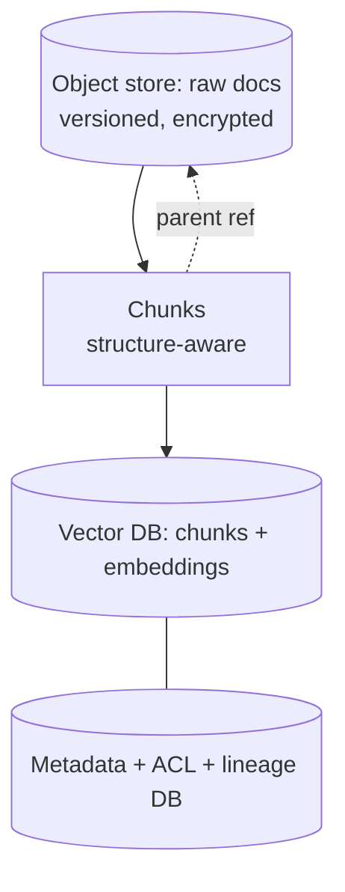
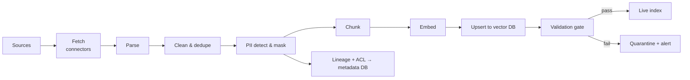
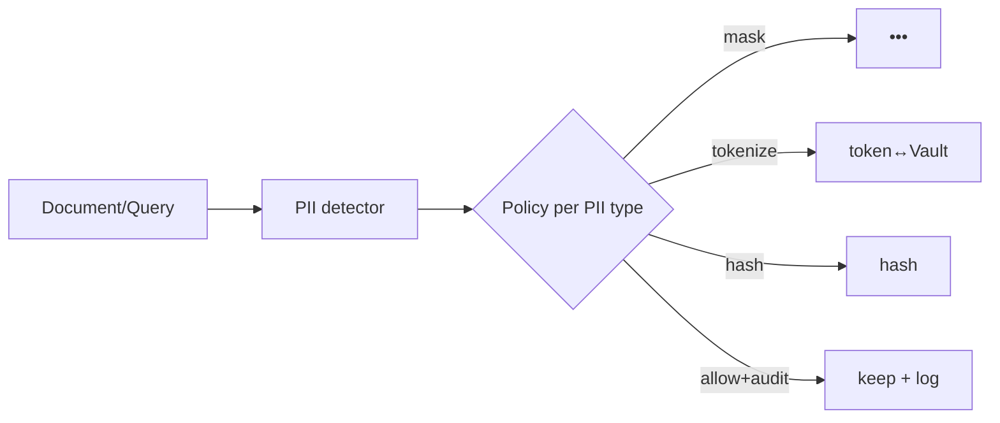

# 05 — Data Strategy & Governance

High accuracy comes mostly from **good data + good retrieval**, not raw model size. This document defines collection, cleaning, knowledge structure, ingestion, governance, PII masking, and compliance.

## 5.1 Data collection process

1. **Source inventory & classification** — catalogue every candidate source (wikis, SharePoint/Confluence, file shares, ERP/HRIS/ITSM, contracts, emails, DBs). Tag each with **owner, sensitivity (Public/Internal/Confidential/Restricted), retention, and access policy**.
2. **Data contracts** — agree with each source owner on schema, refresh cadence, and ACLs. No source is ingested without an owner and a contract.
3. **Connectors** — read‑only service accounts, least privilege, scoped to approved content.
4. **Capture lineage** — record source system, document ID, version, timestamp, owner, sensitivity for every item (stored in metadata store).

## 5.2 Data cleaning methodology

- **Parse** with format‑aware tools (PyMuPDF, Unstructured, Tika); preserve structure (headings, tables, lists).
- **Normalize** encodings, whitespace, boilerplate (headers/footers/nav), deduplicate (content hash + near‑dup via MinHash).
- **Quality filters** — drop empty/low‑information chunks; flag stale/expired documents.
- **Enrich** — add metadata (department, doc type, effective date, ACL tags, language).
- **PII detection & masking** (see §5.6) **before** embedding/storage.
- **Validate** — automated checks (schema, language, PII residue) gate promotion to the live index.

## 5.3 Knowledge base structure

- **Three coupled stores:** raw (object), metadata/ACL/lineage (DB), vectors (vector DB). A chunk links back to its parent document and carries ACL + sensitivity tags.
- **Domains/collections:** segment by security domain (HR, Finance, Procurement, General) so retrieval can hard‑filter by entitlement.
- **Freshness:** effective/expiry dates on documents; retrieval deprioritizes/excludes expired content.

## 5.4 Document ingestion pipeline

- **Orchestration:** Dagster/Airflow; batch (nightly delta) + event‑driven (CDC/webhooks).
- **Idempotent upserts** keyed by content hash + version (no duplicates).
- **Blue/green re‑embedding** when the embedding model changes.
- **Backfill & replay** supported for audits and model changes.

## 5.5 Data governance framework

| Pillar | Control |
|--------|---------|
| **Ownership** | Every dataset/source has a named data owner & steward |
| **Classification** | Public / Internal / Confidential / Restricted, propagated to chunks |
| **Access** | ACL tags enforced at retrieval (row‑level) + RBAC/ABAC at API |
| **Lineage** | Full provenance: source → chunk → answer citation |
| **Quality** | Automated validation gates; data‑quality SLAs per source |
| **Retention** | Per‑source retention & deletion; honor source‑of‑truth deletions |
| **Catalog** | Searchable data catalog (e.g., OpenMetadata/DataHub) |
| **Change mgmt** | Versioned indexes; reproducible re‑builds |
| **Right to erasure** | Delete propagates to raw, vectors, caches, logs (GDPR) |

A **Data Governance Council** (data owners + security + legal + AI lead) approves new sources, classification, and use cases.

## 5.6 PII masking strategy

1. **Detect** — combine NER (Presidio / spaCy / regex) for emails, phones, IDs, names, account numbers, plus custom recognizers for company‑specific identifiers.
2. **Decide per field** — policy table maps PII type → action: **mask, tokenize (reversible via Vault), hash, redact, or allow** (with justification).
3. **Mask before storage** — embed/store the masked form so PII never enters the vector DB or logs by default.
4. **Reversible tokenization** only where the use case needs it (e.g., HR), with access‑controlled detokenization and full audit.
5. **Output‑side guardrail** — scan generated answers for PII leakage before returning.
6. **Logs** — scrub PII from prompts/responses in observability stores; keep raw only in the restricted audit store if legally required.

## 5.7 Compliance requirements

| Framework | What we do |
|-----------|------------|
| **GDPR / local privacy** | Lawful basis, data minimization, PII masking, right to erasure (propagated), DPIA for high‑risk use cases, records of processing |
| **ISO 27001 / SOC 2** | ISMS, access control, encryption, logging, change mgmt, vendor mgmt, continuous monitoring |
| **Sector rules** (e.g., HIPAA, PCI‑DSS, GLBA, financial regs) | Apply if relevant data classes are processed; segregate & add controls accordingly |
| **AI‑specific (e.g., EU AI Act)** | Classify use cases by risk; document datasets, evaluations, human oversight; maintain model cards & decision logs |
| **Internal policy** | Acceptable‑use policy for AI, model approval register, audit trails |

**Outputs maintained:** Records of Processing, DPIAs, model cards, dataset datasheets, eval reports, audit logs, and a use‑case risk register — all version‑controlled and review‑gated.
