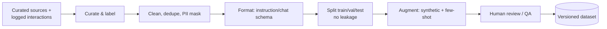
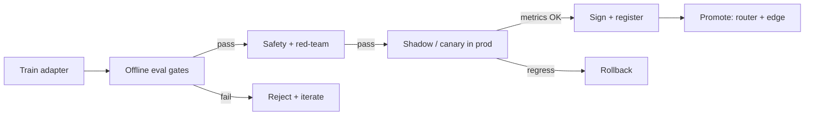

# 06 — Model Training & Fine‑Tuning

## 6.1 Philosophy: RAG first, fine‑tune second

- **RAG** handles **facts** that change (policies, prices, procedures) — update by re‑indexing, no retraining.
- **Fine‑tuning** handles **behavior** that's stable: tone/voice, output format/structure, domain terminology, task skills (classification, extraction, function‑calling style), and refusal behavior.
- **Order of escalation:** prompt engineering → RAG → few‑shot → **LoRA/QLoRA fine‑tune** → (rarely) full fine‑tune / continued pre‑training.

> Do **not** fine‑tune to inject knowledge that changes frequently — that's RAG's job and avoids costly, stale retraining.

## 6.2 Fine‑tuning approach

| Technique | When | Cost | Notes |
|-----------|------|------|-------|
| **Prompt + few‑shot** | First attempt | ~0 | Often enough with good RAG |
| **LoRA** | Behavior/format/skill, ≤34B, have GPU | Low | Trainable adapters, base frozen; swappable per use case |
| **QLoRA** | Same but 70B on 1–2×80GB | Lowest | 4‑bit base + LoRA adapters; best cost/quality |
| **Full fine‑tune** | Deep domain shift, smaller models | High | Rarely needed; needs lots of clean data + GPU |
| **Continued pre‑training** | New domain/jargon at scale | Very high | Only with large, high‑quality unlabeled corpus |
| **Preference tuning (DPO/ORPO)** | Align tone/helpfulness/refusals | Medium | After SFT, with preference pairs |

**Recommendation:** Standardize on **QLoRA/LoRA** with **adapter‑per‑use‑case** so one base model serves many tasks; merge adapters only when needed for serving efficiency.

## 6.3 LoRA / QLoRA strategy (concrete)

- **Stack:** Hugging Face `transformers` + `peft` + `trl` + `bitsandbytes`; or **Axolotl** / **Unsloth** / **LLaMA‑Factory** for turnkey configs. Track with MLflow + DVC.
- **Typical config:** rank `r=16–64`, `alpha=2×r`, dropout 0.05, target attention + MLP projections; LR ~1e‑4 to 2e‑4 (cosine), 1–3 epochs, bf16, gradient checkpointing, packing.
- **QLoRA:** load base in **NF4 4‑bit**, double quantization, paged optimizers — enables 70B on 1–2×80GB.
- **Serving:** keep adapters separate (hot‑swap by task) or merge into base for a single optimized artifact; serve via vLLM (supports LoRA).
- **Reproducibility:** pin base model hash, dataset version, seed, and config; store all in the registry.

## 6.4 Dataset preparation methodology

- **Sources:** SME‑authored Q&A, approved docs turned into instruction pairs, **anonymized real user interactions** (governed, consented), synthetic data generated by a strong open model then **human‑reviewed**.
- **Format:** consistent chat/instruction schema (system, user, assistant; tool calls where relevant).
- **Hygiene:** PII masking, dedup, **strict train/test separation** (no eval contamination), balanced coverage across use cases and difficulty.
- **Versioning:** every dataset is immutable + versioned (DVC); changes are reviewable.

## 6.5 Evaluation metrics

| Dimension | Metrics |
|-----------|---------|
| **RAG quality** | Groundedness/faithfulness, context precision/recall, answer relevance (e.g., RAGAS), citation correctness |
| **Answer quality** | Exact/semantic match vs. gold, task accuracy (classification F1, extraction F1), helpfulness |
| **Safety** | PII‑leak rate, prompt‑injection resistance, correct‑refusal rate, toxicity |
| **Performance** | TTFT, tokens/s, p50/p95 latency, $/1k tokens, GPU util |
| **Robustness** | Adversarial/edge‑case pass rate, regression vs. previous version |
| **Human eval** | SME ratings (1–5) on a rubric; pairwise A/B; win‑rate |

## 6.6 Benchmarking framework

- **Internal eval set is primary** — built from our use cases (Q, gold answer, gold sources), versioned, kept secret from training.
- **Public benchmarks secondary** — use MMLU/IFEval/GSM8K/coding sets only as sanity signals, never as the decision driver.
- **Automated harness:** nightly + on every model/adapter/prompt change; results to the model registry & dashboards; **LLM‑as‑judge** (a strong open model) for scalable scoring, calibrated against human labels.
- **Tooling:** `lm-evaluation-harness`, RAGAS, promptfoo, custom pytest suites; Langfuse for online eval on sampled production traffic.

## 6.7 Model validation & promotion process

**Promotion gates (all must pass):**
1. Beats current production on the internal eval set (no regression on any critical metric).
2. Safety/red‑team thresholds met (PII leak, injection, refusal).
3. Latency/cost within budget.
4. **Shadow/canary** on live traffic shows no quality or error regressions.
5. Artifact **cryptographically signed**, recorded in registry with full lineage (base hash, dataset version, config, eval report, approver).
6. Rollback plan verified; edge devices receive signed update via the secure channel ([Doc 07](./07-security-and-connectivity.md)).

**Cadence:** continuous data curation; scheduled re‑eval on new base‑model releases; adapters re‑trained when drift or new requirements appear.
