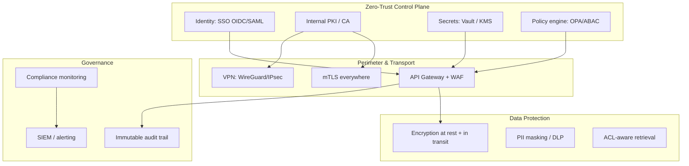
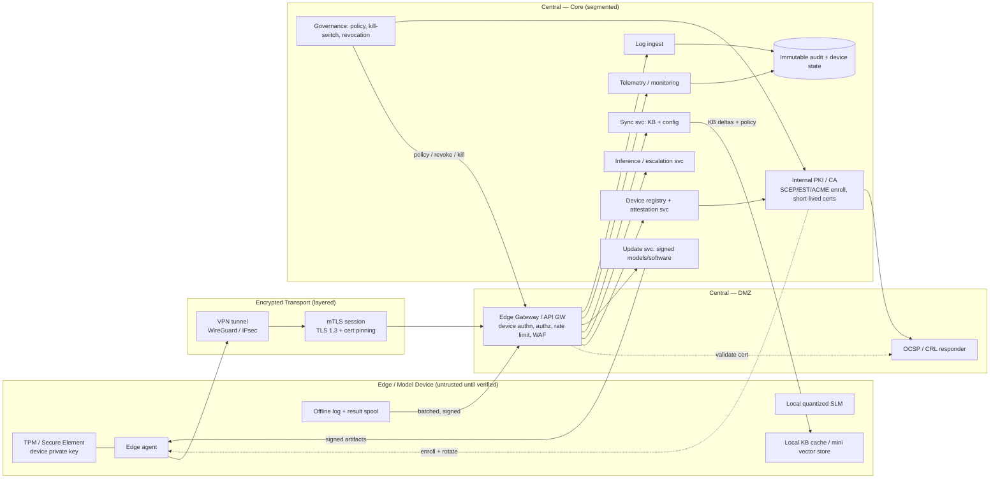

# 07 — Security, Compliance & Secure Connectivity

This document covers the security controls for the platform **and** the **secure connectivity between open‑model edge devices and the central server** (VPN, TLS/mTLS, API gateways, certificate‑based authentication) — a first‑class requirement of this solution.

Guiding model: **Zero Trust** — never trust, always verify; least privilege; assume breach; verify every request and device, every time.

## 7.1 Security control domains

### Data privacy
- Hard **trust boundary**: no proprietary data leaves the organization; **no external inference APIs** for sensitive data.
- **PII masking** before storage/logging; **DLP** egress scanning; output guardrails block PII/secret leakage.
- Data minimization, classification‑driven handling, right‑to‑erasure propagation (see [Doc 05](./05-data-strategy.md)).

### User access management
- **AuthN:** corporate **SSO (OIDC/SAML)**, MFA enforced; service accounts use mTLS client certs.
- **AuthZ:** **RBAC + ABAC** via a policy engine (OPA). Roles (employee, manager, finance, HR, admin) + attributes (department, clearance, data domain). Enforced at **gateway** and again at **retrieval** (ACL filter) — defense in depth, so a user can never retrieve documents outside their entitlements.
- **Least privilege & JIT:** time‑bound elevation for admins; quarterly access reviews; automated deprovisioning on HR offboarding.

### Audit trails
- **Immutable, append‑only (WORM)** audit store for: authentication, authorization decisions, every query + retrieved sources + model used, tool/action invocations, admin actions, model promotions, device enrollment/revocation, config changes.
- Tamper‑evident (hash‑chained); retention per policy; feeds **SIEM**.
- Every AI answer is **attributable**: who asked, what was retrieved, which model/version, what was returned.

### Encryption
| State | Control |
|-------|---------|
| In transit | TLS 1.3 externally; **mTLS** service‑to‑service and device‑to‑server; VPN tunnel underneath |
| At rest | AES‑256 (disk/volume + application‑level for sensitive fields); encrypted vector DB & object store |
| Keys | Centralized in **Vault/KMS/HSM**; rotation, separation of duties, no plaintext keys in code/config |
| In use (optional) | Confidential computing / TEE for highest‑sensitivity workloads |

### Compliance monitoring & regulatory
- Continuous control monitoring (config drift, access anomalies, policy violations) into SIEM with alerting.
- Map controls to **ISO 27001 / SOC 2 / GDPR** and applicable sector regs (HIPAA/PCI/GLBA/financial) — see [Doc 05 §5.7](./05-data-strategy.md).
- **AI governance:** model cards, dataset datasheets, eval reports, use‑case risk classification (EU AI Act style), human‑oversight records.
- Regular pen‑testing, red‑teaming (incl. prompt injection & jailbreak), and third‑party audits.

### AI‑specific threats & mitigations
| Threat | Mitigation |
|--------|-----------|
| Prompt injection / jailbreak | Input/output guardrails, instruction hierarchy, content/source isolation, allow‑list tools, eval suite |
| Data exfiltration via prompts | Output DLP, PII guardrails, retrieval ACLs, no tool egress without policy |
| Model/data poisoning | Source vetting, ingestion validation gates, signed datasets, provenance |
| Supply‑chain (weights/deps) | Verify model hashes, scan containers, SBOM, model approval register |
| Insecure tool/function calling | Sandboxed executors, least‑privilege creds, HITL for high‑risk actions |
| Sensitive data in logs | PII scrubbing in observability; raw only in restricted audit store |

## 7.2 Secure device‑to‑server connectivity (detailed)

The platform must let **open‑source AI model devices / edge deployments** talk to the central server for **inference, synchronization, monitoring, updates, logging, and centralized governance** — with strict security, authentication, encryption, and access controls.

### 7.2.1 End‑to‑end connectivity architecture

### 7.2.2 Layered controls (defense in depth)

| Layer | Control | Detail |
|-------|---------|--------|
| **L1 Device identity** | Hardware root of trust | Device key in **TPM 2.0 / secure element**; non‑exportable. Optional **remote attestation** of boot + agent integrity before trust. |
| **L2 Enrollment** | Onboarding | Zero‑touch or admin‑approved enrollment via **SCEP/EST/ACME**; CSR signed by device key → CA issues device cert bound to device ID + role/scope. |
| **L3 Network** | **VPN** | **WireGuard** (preferred: modern, fast, small attack surface) or **IPsec**; device only reachable through the tunnel; central exposes nothing else to devices. |
| **L4 Transport** | **TLS/mTLS** | **Mutual TLS (TLS 1.3)** on top of the VPN; both sides present certs; **certificate pinning**; strong cipher suites only. |
| **L5 Gateway** | **API gateway** | Terminates mTLS, verifies device cert + OCSP/CRL status, enforces **per‑device authz scope**, rate limits, WAF, schema validation, request signing. |
| **L6 Authorization** | Scoped access | Device cert maps to a **device role**; can only call permitted endpoints (e.g., escalate‑inference, sync, telemetry) and access permitted data domains. |
| **L7 Payload** | Integrity & confidentiality | All payloads encrypted (mTLS); **model/config updates cryptographically signed**; logs signed at source; replay protection (nonces/timestamps). |
| **L8 Governance** | Central control | Device registry, **certificate rotation** (short‑lived certs, auto‑renew), **revocation (CRL/OCSP)**, remote **kill‑switch**, policy push, full audit. |

### 7.2.3 Certificate‑based authentication & PKI

- **Internal PKI** (Vault PKI / step‑ca / ADCS) with an offline root and online intermediates.
- **Short‑lived device certificates** (e.g., hours–days) auto‑renewed by the agent → small blast radius if leaked.
- **Enrollment protocols:** EST/SCEP/ACME; CSR generated on‑device with the TPM‑held key so the private key never leaves the device.
- **Validation:** gateway checks chain, validity, **revocation (OCSP stapling / CRL)**, and that the cert's identity/scope matches the requested operation.
- **Rotation & revocation:** automated rotation; instant revocation on compromise/decommission; revoked devices are blocked at gateway and VPN.

### 7.2.4 Per‑function security

| Function | Security treatment |
|----------|--------------------|
| **Inference** (local + escalation) | Sensitive inference can run **locally** on the edge SLM (data never leaves device); escalations go over mTLS to central LLM with scope checks + audit. |
| **Synchronization** | KB deltas/embeddings/config pushed over mTLS; **signed**; device verifies before applying; integrity‑checked, resumable. |
| **Monitoring/telemetry** | Health/metrics/heartbeats over mTLS; anomalies (missed heartbeat, abnormal usage) trigger alerts and optional auto‑quarantine. |
| **Updates** | **Signed** model + software + config; staged/canary rollout; device verifies signature + hash; atomic apply with rollback; version pinning. |
| **Logging** | Buffered offline, **signed**, batched, deduped on reconnect; lands in central immutable audit store. |
| **Governance** | Central policy, cert rotation, revocation, and **kill‑switch**; can disable a device, force re‑attestation, or wipe local cache remotely. |

### 7.2.5 Offline & resilience
- Edge devices keep functioning **offline** using the local SLM + cached KB; queue logs/results; sync securely on reconnect.
- **Fail‑secure:** if a device can't validate its cert/policy within a TTL, it restricts to a safe local‑only mode and refuses central operations.
- **Tamper response:** failed attestation or detected tampering → device self‑quarantines and alerts central.

### 7.2.6 Network segmentation
- Devices land in a **dedicated VPN segment / DMZ**; the **edge gateway** is the only path to core services; **micro‑segmentation** isolates inference, data, and management planes; east‑west traffic also mTLS‑authenticated (service mesh, e.g., Istio/Linkerd).

## 7.3 Security checklist (production gate)

- [ ] SSO + MFA; RBAC/ABAC enforced at gateway **and** retrieval
- [ ] Internal PKI live; short‑lived certs; OCSP/CRL; automated rotation
- [ ] WireGuard/IPsec VPN for all edge devices; nothing else exposed
- [ ] mTLS (TLS 1.3) on every hop; cert pinning; strong ciphers only
- [ ] API gateway: authn/authz, rate limit, WAF, schema validation
- [ ] Encryption at rest (AES‑256) + in transit everywhere; keys in Vault/HSM
- [ ] PII masking + DLP + output guardrails; prompt‑injection defenses
- [ ] Immutable, hash‑chained audit trail → SIEM
- [ ] Signed models/configs; verified hashes; SBOM; model approval register
- [ ] Device registry, attestation, kill‑switch, revocation tested
- [ ] DR/backup tested; incident response runbook; pen‑test + red‑team passed
- [ ] Compliance mappings (ISO 27001/SOC 2/GDPR/sector) documented and reviewed
