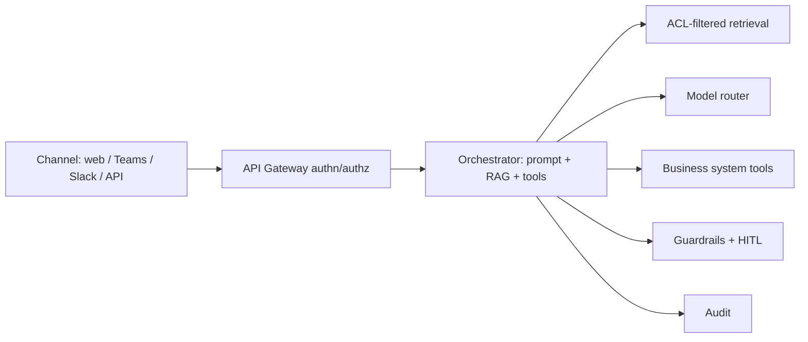

# 08 — Business Applications

Each assistant is built on the **same platform** (RAG + model router + guardrails + tools), differing mainly in **knowledge sources, prompts, tools, model tier, and risk controls**. This maximizes reuse and governance.

## Common application pattern

| Assistant | Use case | Knowledge sources | Tools / actions | Model tier | Risk controls |
|-----------|----------|-------------------|-----------------|------------|---------------|
| **Internal chatbot** (U1) | General employee Q&A | Wikis, policies, HR/IT docs | Search, link‑out | SLM + RAG | Citations; low risk |
| **SOP assistant** (U2) | Step‑by‑step procedure guidance | SOP repo, process docs | Checklist, doc deep‑link | SLM + RAG | Show source SOP + version |
| **Procurement** (U3) | Vendor/contract Q&A, PO drafting | Contracts, vendor master, ERP | Vendor lookup, **draft PO**, clause check | Open LLM + RAG | **HITL approval** for POs; citations; audit |
| **Finance** (U4) | Policy Q&A, report summarization, variance | GL/ERP, finance policies, reports | Query reports, summarize, **flag anomalies** | Open LLM + RAG | **HITL** for any posting/action; numeric‑grounding checks; strict audit |
| **HR** (U5) | Leave/benefits/policy, onboarding | HRIS, handbooks, policies | Policy lookup, ticket creation | SLM/LLM + RAG | **Strict PII controls**, ACL by employee, sensitive‑topic escalation |
| **Knowledge mgmt** (U6) | Enterprise search + synthesis | All repositories | Hybrid search, summarize, cite | LLM + RAG (hybrid) | ACL‑aware; cross‑domain filtering |
| **Workflow automation** (U7) | Draft/classify/extract/trigger | Tickets, emails, forms, ERP | Classify, extract, **call APIs**, route | LLM + tools (agentic) | **HITL** for state‑changing actions; sandboxed tools; least‑privilege creds |

## Implementation guidance per assistant

### Internal chatbot (U1)
- Channels: web widget + Teams/Slack bot. Default model: SLM + RAG.
- Start here — broadest reach, lowest risk; great for proving value and adoption.

### SOP assistant (U2)
- Structure SOPs as steps; retrieval returns the exact procedure + version; render as an interactive checklist; always cite the SOP ID/version.

### Procurement assistant (U3)
- Read‑only Q&A first; add **PO drafting** as a tool that produces a draft for **human approval** (HITL) before submission to ERP. Contract‑clause comparison with citations.

### Finance assistant (U4)
- Emphasis on **numeric grounding**: pull figures from systems of record, never "invent" numbers; summarize/explain variances with sources. Any posting/transaction is HITL‑gated and fully audited.

### HR assistant (U5)
- Highest **privacy** sensitivity: per‑employee ACLs, PII masking, and escalation paths for sensitive topics (grievances, health, payroll disputes) to a human. Strict audit.

### Knowledge management assistant (U6)
- Hybrid search across all governed sources with **ACL‑aware retrieval**; synthesizes answers with citations; good candidate for the central LLM tier for complex synthesis.

### Workflow automation assistant (U7)
- Agentic: classify/extract/route/trigger. **Every state‑changing action** runs through sandboxed tools with least‑privilege credentials and **human‑in‑the‑loop** approval for high‑impact steps; full audit of each action.

## Rollout order (recommended)
1. **U1 / U8** (chatbot, IT helpdesk) — low risk, high reach → adoption + learnings.
2. **U2 / U6** (SOP, knowledge mgmt) — high ROI, moderate risk.
3. **U5** (HR) — high value, needs privacy hardening.
4. **U3 / U4 / U7** (procurement, finance, workflow) — highest value but require HITL, tools, and strongest controls.
