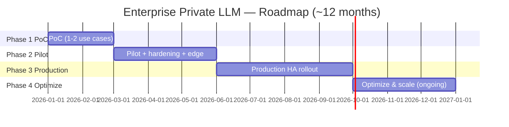

# 09 — Deployment Roadmap

A phased plan that de‑risks the biggest unknowns first (knowledge quality + security) before committing production capex.

## Phase 1 — Proof of Concept (6–8 weeks)

**Goal:** Prove RAG answer quality on 1–2 low‑risk use cases (U1 chatbot, U2 SOP) and validate the security model.

| Aspect | Detail |
|--------|--------|
| Scope | 1–2 use cases, curated subset of docs, internal eval set, single GPU (private cloud) |
| Build | Ingestion → vector DB → embeddings → RAG → 1 SLM + 1 LLM via vLLM; basic gateway + SSO; baseline guardrails |
| Team | 1 AI/ML eng, 1 data eng, 1 platform/devops, 0.5 security, 0.5 product, SME time |
| Dependencies | Access to source docs; GPU; SSO test integration |
| Risks | Poor retrieval quality; messy source data; scope creep |
| **Success criteria** | ≥ 85–90% groundedness on eval set; SMEs rate answers useful; security model reviewed; cost/answer measured |
| Exit | Go/No‑go to Pilot with quality + cost evidence |

## Phase 2 — Pilot (8–12 weeks)

**Goal:** Limited production use with real users; harden security; pilot **edge** deployment.

| Aspect | Detail |
|--------|--------|
| Scope | 2–4 use cases, low‑hundreds users, more sources, **edge SLM pilot** on a few devices |
| Build | HA‑ish serving, model router, full guardrails + PII masking, RBAC/ABAC, audit logging, **PKI + mTLS + VPN for edge**, observability (Langfuse/Grafana) |
| Team | + MLOps eng, + security eng, + part‑time SRE |
| Dependencies | PKI stand‑up; network/VPN approvals; data governance sign‑off |
| Risks | Security gaps; data quality at scale; adoption; edge connectivity issues |
| **Success criteria** | Stable in prod for pilot users; security controls verified (pen‑test); edge devices connect/sync/update securely; positive user feedback; cost within target |
| Exit | Go/No‑go to Production |

## Phase 3 — Production Rollout (12–16 weeks)

**Goal:** Full HA rollout, complete security/compliance, multiple assistants, edge fleet.

| Aspect | Detail |
|--------|--------|
| Scope | All approved assistants; org‑wide (phased by department); edge fleet |
| Build | HA cluster (N+1), autoscaling, DR/backup, full SIEM + audit, complete RBAC/ABAC, HITL workflows for U3/U4/U7, on‑prem capacity if justified |
| Team | Full core team; on‑call SRE; security; data governance council active |
| Dependencies | Capex approval/procurement; compliance audit; change management & training |
| Risks | GPU supply/cost; org adoption; regulatory sign‑off; ops maturity |
| **Success criteria** | 99.5%+ availability; SLAs met; passes compliance/pen‑test; adoption targets met; unit cost < commercial API equivalent |
| Exit | Operational handover to steady‑state |

## Phase 4 — Optimization & Scaling (ongoing)

**Goal:** Continuously improve quality and cost; add use cases.

| Activity | Detail |
|----------|--------|
| Quality | LoRA/QLoRA fine‑tuning from governed interaction data; eval‑gated promotion |
| Cost | Quantization, routing tuning, caching, autoscaling, reserved capacity, edge offload |
| Scale | New use cases (U3/U4/U7 agentic), more edge devices, more sources |
| Ops | SLO refinement, drift monitoring, model refresh on new releases, periodic red‑team |
| **Success criteria** | Declining cost/answer; rising accuracy & adoption; expanding ROI; zero data‑leakage incidents |

## Cross‑phase governance
- **Stage gates** between phases with explicit go/no‑go on quality, security, cost, and adoption.
- **Model approval register** and **data governance council** active from Phase 2.
- **Risk register** ([Doc 10](./10-risk-and-resources.md)) reviewed each phase.

## Critical dependencies (summary)
1. Source‑system access + data owners engaged (Phase 1).
2. GPU capacity (cloud → on‑prem path).
3. PKI / network / VPN approvals (Phase 2).
4. Capex + compliance sign‑off (Phase 3).
5. Skilled team (build) + steady‑state ops staffing.
