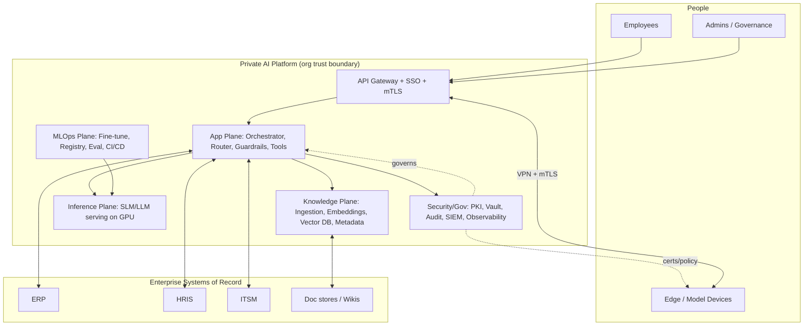

# Architecture Diagrams (Mermaid)

These diagrams are rendered inline in the blueprint documents and collected here for reference. They render automatically on GitHub.

## 1. Logical architecture (layered)
See [03 — Architecture Design §3.1](../03-architecture-design.md#31-logical-architecture-layered-view).

## 2. RAG request sequence
See [03 §3.2 — RAG service](../03-architecture-design.md).

## 3. Secure edge↔server connectivity
See [03 §3.3](../03-architecture-design.md#33-secure-connectivity-edge--model-devices--central-server) and [07 §7.2.1](../07-security-and-connectivity.md#721-end-to-end-connectivity-architecture).

## 4. Ingestion pipeline & knowledge base
See [05 — Data Strategy](../05-data-strategy.md).

## 5. Fine‑tuning / promotion flow
See [06 — Training & Fine‑Tuning](../06-training-and-finetuning.md).

## 6. Roadmap Gantt
See [09 — Deployment Roadmap](../09-deployment-roadmap.md).

---

### Master context diagram (C4‑style container view)

